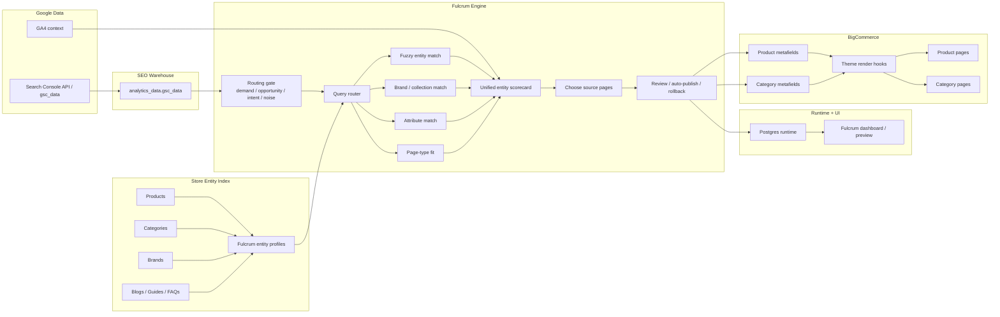

# Fulcrum Entity Router Architecture

Fulcrum's primary routing path is now:

`analytics_data.gsc_data -> explicit routing gate -> unified entity index -> direct entity scorecard -> review/publish -> BigCommerce metafields`

The legacy `generate_internal_links.py` graph is no longer the intended main decision layer.

## Mermaid

## Notes

- Fuzzy entity match, brand, attributes, and page-type fit are the main drivers.
- The explicit gate works on normalized query families and decides `pass`, `hold`, or `reject` before entity routing.
- Demand, opportunity, intent clarity, and noise drive the gate. Opportunity is mainly rank-based, with page-type mismatch as an override.
- Intent clarity is now `catalog-first`:
  - brands come from BigCommerce brand data and persisted aliases
  - hard and soft attributes come from options, option values, and synced product profiles
  - topic tokens come from category taxonomy before heuristic fallbacks
  - SKU/model signals come from product and variant SKU data before regex fallback
  - collection is a separate signal type, not folded into brand
- Store-scoped intent enrichments are persisted in `app_runtime.store_intent_signal_enrichments`.
- Agent-backed enrichment is async-only and optional. It can label ambiguous signals during sync/background work, but live request-time routing never waits on an agent call.
- GA4 is a tie-break layer only. It nudges close calls with engagement/conversion evidence, but it does not override search intent from GSC.
- Products, categories, brands, and content entities can compete in the same router.
- The unified entity index is `publishable-only` by default:
  - hidden entities are excluded
  - placeholder/test entities are excluded
  - duplicate/suffixed variants are collapsed to a preferred canonical target when a stronger base URL exists
- Source-page selection still uses current page evidence from GSC and existing renderable entity types.
- Content entities can come from published blog rows or content-shaped backlog URLs when blog rows are missing.
- Learning is intentionally moderate:
  - approvals reward future similar matches
  - rejections weaken future similar matches
  - manual overrides count as a stronger but bounded signal
- Auto-publish scope stays limited to `products + categories`; brands and content remain review-gated.
- Default operator cadence is:
  - daily GSC + catalog sync
  - weekly candidate generation

## Separation Contract

Fulcrum uses three separate decision layers:

1. `Gate`
2. `Routing`
3. `Publish`

They are intentionally not interchangeable.

`Gate`:

- evaluates the normalized query family before routing
- decides only `pass`, `hold`, or `reject`
- should be explainable from family-level evidence such as demand, opportunity, clarity, and noise

`Routing`:

- runs after the gate
- compares the family against candidate entities and surfaces a best target
- can legitimately end in:
  - reroute to a different target
  - same-page winner
  - no usable target

`Publish`:

- is the live-block execution layer
- should only happen when a row both:
  - passed the gate
  - has a valid publishable source/target action

Hard architecture rule:

- a failed gate must not later acquire a routing reason as its primary explanation
- routing can explain a `pass` row
- routing must not overwrite a `hold` or `reject` row

Corollary:

- `Routing - Same Page Winner` is valid only for rows that already passed the gate
- same-page equality discovered after routing must not be used to recast a failed gate as a routing success or routing classification

## Diagnostic Metadata

Some signals remain useful for analysis without being authoritative reasons.

Current example:

- `current_page_preservation_guard`

This signal can be stored in metadata and inspected in admin diagnostics, but it is not a standalone gate disposition and it must not become a user-facing primary reason for `hold` or `reject`.

## Review Workflow Contract

The review loop is part of the routing architecture, not just the UI.

User-side:

- `Review`
  - creates or updates a review request
  - pauses live blocks for the source page if needed
  - removes approved/live state from the affected source so the request can be audited cleanly

Admin-side:

- `Resolve`
  - closes the review request only
  - does not restore live output
- `Approve`
  - closes the review request
  - attempts to restore and republish the reviewed source/target path
  - may resolve successfully even if no live block is restored

This gives Fulcrum one explicit safety valve:

- user does not need to diagnose gate vs routing
- user sends the row to review
- admin decides whether to keep it off or restore it live

## Threshold Tuning Guardrail

Threshold tuning belongs inside the gate layer.

Examples:

- top-10 suppression thresholds
- low-clarity thresholds
- noise cutoffs
- demand / opportunity thresholds

Threshold tuning must not depend on downstream routing labels to justify failed gate outcomes.

## V2 Note

Merchant Center should stay out of the current router path.

For `v2`, use Merchant API only as a PDP validation and product-health layer:

- verify attribute-led PDP landing pages
- suppress disapproved or broken product targets
- add product-performance hints as a secondary tie-break signal
