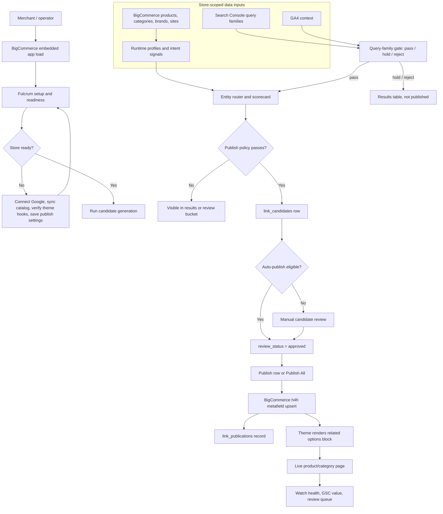
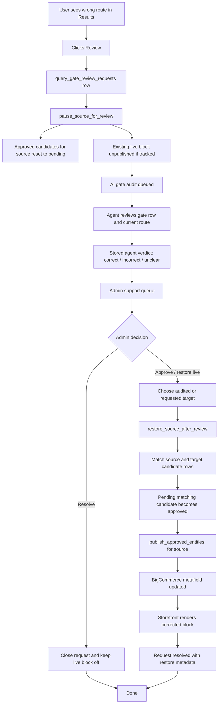

# Route Authority Hardening Report

Generated: 2026-05-03

## Summary

Route Authority now blocks the weak brand-query path that allowed `downlite blankets` to publish a broad category target. Brand pages are loaded from the installed BigCommerce app token when the legacy import table is missing, brand-family routes preserve brand intent, and stale approved candidates that fail current publish policy are excluded from future Publish All runs.

BigCommerce cleanup is now live for the reviewed Cloud Top target only. The broader store audit remains dry-run evidence; no full-store metafield reset was executed.

## Bug Report

| Scenario | Expected | Actual Before | Root Cause | Fix | Verification |
| --- | --- | --- | --- | --- | --- |
| Neon signal refresh on Render | Signal library refresh completes | Refresh failed when `h4h_import2.product_sku_mapping` or `h4h_import2.variants` was absent | SKU loader assumed local legacy import tables always exist | SKU loader now checks table existence and skips missing optional legacy SKU sources | `python -m unittest app.fulcrum.tests.test_intent_signals` |
| Brand pages on Render/Neon | Brand targets like `/downlite/` and `/1888-mills/` are available | `load_store_brand_profiles()` returned zero brand targets on Neon | Loader only read `h4h_import2.brands`; Neon runtime does not have that table | Brand loader falls back to live BigCommerce `/catalog/brands` using the installed app token | `python deploy/run_fulcrum_logic_regression.py --store-hash 99oa2tso --strict` |
| `hotel suite pillows` | Route to pillow category, not a Suite brand | Product brand token enrichment could treat `suite` as brand-led | Product brand token aliases ignored ambiguous static modifier tokens | Ambiguous brand-token blocklist skips `suite` token while preserving full brand phrases | strict logic regression |
| `kartri shower curtain` | Route to a Kartri product | Semantics classified product-like but still blocked product targets | Brand-family guard ran even when query shape was already product-like | Brand-family guard now applies only to true brand-navigation cases | strict logic regression |
| `1888 mills` | Route to base `1888 Mills` brand | Sub-brands could outrank the exact brand page | Sort only used score after brand target eligibility | Brand-navigation ranking now boosts exact brand-name matches over sub-brands | strict logic regression |
| Existing stale approvals | Do not republish stale brand-query category rows | Publish All could republish old approved rows even after routing policy changed | Publish path did not re-check current publish policy | Publish All and direct publishing now exclude approved rows that violate target policy | `python -m unittest app.fulcrum.tests.test_candidate_runs app.fulcrum.tests.test_publishing` |
| Full-store BigCommerce audit | Audit must be bounded/dry-run capable | Full scan could run too long | Audit lacked entity filters and policy-blocked reporting | Audit supports `--product-id`, `--category-id`, `--max-entities`, and reports policy-blocked remotes | `python deploy/run_fulcrum_bc_reset_publish.py --store-hash 99oa2tso --product-id 112556` |

## Production Smoke

Automated checks:

- `python deploy/run_fulcrum_release_checks.py`: passed, 253 tests.
- `python -m unittest discover app/fulcrum/tests`: passed, 253 tests.
- `python deploy/run_fulcrum_logic_regression.py --store-hash 99oa2tso --strict`: passed, 29/29.

Live read-only checks:

- `https://fulcrum.fulcrumagentics.com/fulcrum/health?store_hash=99oa2tso`: `200`, `status: ok`, product/category theme hooks true.
- `https://fulcrum.fulcrumagentics.com/fulcrum/readiness?store_hash=99oa2tso`: `200`.
- `https://fulcrum.fulcrumagentics.com/fulcrum/results?store_hash=99oa2tso`: `200`.
- `https://fulcrum.fulcrumagentics.com/fulcrum/setup?store_hash=99oa2tso`: `200`.
- `/fulcrum/privacy`, `/fulcrum/terms`, `/fulcrum/support`: `200`.
- Unsupported store health check returned `403`.

Cloud Top dry-run audit:

- Command: `python deploy/run_fulcrum_bc_reset_publish.py --store-hash 99oa2tso --product-id 112556`
- Remote Route Authority metafields found: `1`.
- Orphan remotes by source/key: `0`.
- Policy-blocked active remotes: `1`.
- Flagged remote: product `112556`, `internal_links_html`, metafield `11377`.

Go-live cleanup and publish proof:

- Full bounded dry-run before cleanup: `remote_before_count=206`, `orphan_remote_count=159`, `policy_blocked_active_remote_count=21`.
- Reviewed cleanup command: `python deploy/run_fulcrum_bc_reset_publish.py --store-hash 99oa2tso --execute --delete-reviewed-metafield product:112556:11377`.
- Cleanup result: `deleted_reviewed_metafield_count=1`, `remote_after_count=0` for product `112556`.
- Post-cleanup Cloud Top audit: `policy_blocked_active_remote_count=0`, `remote_before_count=0`.
- Cloud Top storefront verification: Route Authority `Related options` block removed; remaining `Hotel Bedding Supply` text is normal navigation/breadcrumb content.
- Publish All result: `approved_source_count=24`, `published_source_count=24`, `publication_write_count=25`, `unresolved_approved_source_count=0`.
- Sample publish proof: product `100667` has `h4h/internal_links_html` and the storefront renders `Related options` with `Borderless Towel`.

## User To Publish Flow

## Review To Admin To Republish Flow

Operational rule: the AI audit is an advisor. It stores a verdict and recommended action, but it does not publish by itself. Republish happens only when admin chooses the restore/live-fix action, which calls `restore_source_after_review()` and then `publish_approved_entities()`.

## What Still Needs Completion

| Item | Current status | Completion condition |
| --- | --- | --- |
| Cloud Top stale/policy-blocked metafield cleanup | Complete for reviewed target `product:112556:11377` | Keep broader orphan/policy-blocked audit findings dry-run until separately reviewed |
| Live publish proof after cleanup | Complete: Publish All wrote 25 metafields across 24 source pages and sample storefront render passed | Continue spot-checking live blocks during launch week |
| Worker automation | `scheduler_enabled=false` and `embedded_scheduler_enabled=false`; worker is intentionally skipped to avoid cost | Add `fulcrum-sync-worker` or accept manual-ops alpha status |
| Multi-store production proof | Code is store-scoped and unsupported store health returned `403`; only `99oa2tso` has been smoke-tested deeply | For each new store: install, allowlist, sync catalog/sites, run strict regression, dry-run audit, publish one proof block, verify rollback |
| Marketplace evidence packet | Current screenshots and JSON evidence captured under `docs/bigcommerce_marketplace_assets/2026-05-03/` | Keep provider portal screenshots outside Git if they expose secrets |
| Operational monitoring cadence | Watchdog run completed with `overall_status=watch`; no urgent alerts | Review the unresolved mapping backlog and run watchdog daily during launch week |

## Multi-Store Checklist

1. Add the store hash to `FULCRUM_ALLOWED_STORES` only after BigCommerce install/auth succeeds.
2. Confirm the installed app token is present in `app_runtime.store_installations`; do not rely on a stale global token.
3. Run catalog sync and confirm nonzero product/category profile counts.
4. Refresh intent signal enrichments and confirm brand profiles load from either runtime data or BigCommerce brand API fallback.
5. Run strict logic regression for the store.
6. Run a bounded dry-run BigCommerce metafield audit before any cleanup.
7. Verify unsupported stores still return `403`.
8. Do not run BigCommerce deletes or cleanup until the dry-run sample is reviewed.

## Current Evidence

- Evidence bundle: `docs/bigcommerce_marketplace_assets/2026-05-03/route-authority-go-live-evidence-2026-05-03.json`
- Screenshots: setup, results, review queue, developer readiness, privacy, terms, and support are in `docs/bigcommerce_marketplace_assets/2026-05-03/`.
- Watchdog status: `watch`, with one non-urgent alert for `214` unresolved option mapping items and one normal review-queue item.
